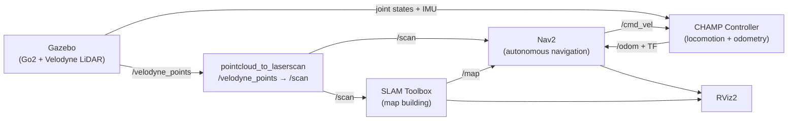

# Autonomous Navigation on Unitree Go2 (branch `unitree_go2`)

The `unitree_go2` branch extends this course with a real quadruped robot project: **autonomous navigation on the Unitree Go2** using SLAM and Nav2, running in a Gazebo simulation with a Velodyne VLP-16 3D LiDAR.

This project ties together the skills from Sections 3–12 of the course — locomotion control, TF2, odometry, sensor fusion, SLAM, and Nav2 — applied to a legged robot instead of a wheeled one.

### Documentation

| Document | Description |
|----------|-------------|
| [`Ros2-go2/README.md`](Ros2-go2/README.md) | Setup, Docker, SLAM workflow, and autonomous navigation launch guide |
| [`Ros2-go2/go2_ws/src/unitree-go2-ros2/README.md`](Ros2-go2/go2_ws/src/unitree-go2-ros2/README.md) | Full installation, launch commands, gait tuning, and package status |
| [`Ros2-go2/go2_ws/src/unitree-go2-ros2/PACKAGES.md`](Ros2-go2/go2_ws/src/unitree-go2-ros2/PACKAGES.md) | Detailed description of every ROS package (`champ/`, `champ_teleop/`, `robots/`) |

---

*Robotics Academy — ROS 2 Course*
