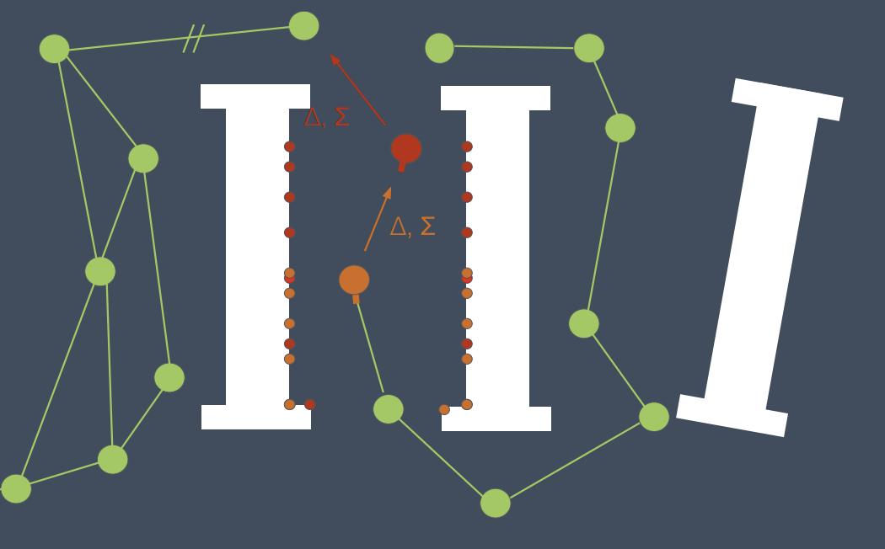
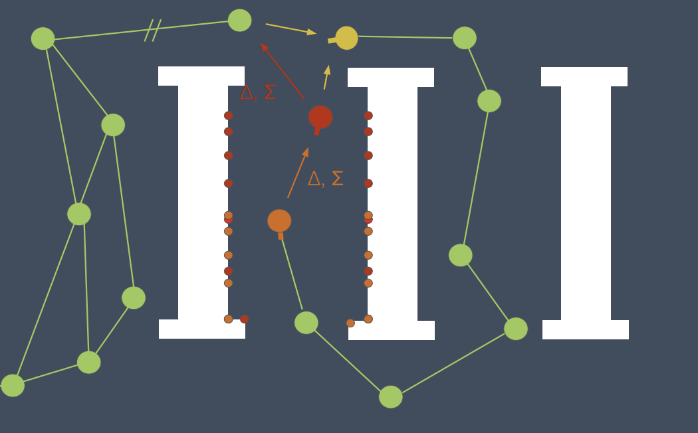
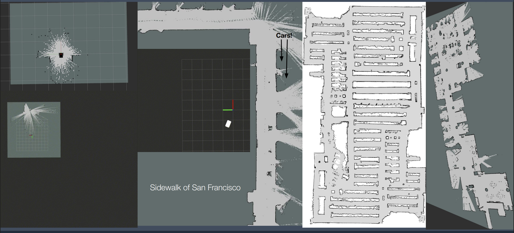

# Chapter 8 - SLAM: Two Paradigms — Visual (Duckibot) and LiDAR (Turtlebot)

> _Goal_: understand the mathematical foundations of graph-SLAM and compare two concrete implementations: **visual SLAM with rtab-map** on the duckibot (monocular camera + wheel odometry), and **LiDAR SLAM with slam_toolbox** on the turtlebot.

> _Teaching note_: both pipelines are already implemented. Students run and compare them; no code authoring is required.

Source material:

- [ROSCon 2019 SLAM Toolbox slides](assets/recitation8_slam_toolbox/roscon2019_slamtoolbox.pdf)

---

## 1 Why Two SLAM Paradigms?

SLAM (Simultaneous Localization and Mapping) requires estimating the robot pose while building a map of an unknown environment. The core algorithm is the same in both approaches — **graph-based MAP estimation** — but the *sensor* that provides measurements determines everything about cost, robustness, and complexity.

| Property | LiDAR SLAM (`slam_toolbox`) | Visual SLAM (`rtab-map`) |
|---|---|---|
| **Sensor** | 2D rotating LiDAR (`/scan`) | Monocular camera (`/camera`) |
| **Measurement** | Direct metric range at each angle | Pixel intensities → feature descriptors |
| **Scale** | Metric (from geometry) | Ambiguous — resolved here by wheel `/odom` |
| **Map output** | 2D occupancy grid | 2D occupancy grid + appearance database |
| **Loop closure** | Scan-to-scan correlation | Bag-of-Words image retrieval |
| **CPU cost** | Low | Medium–high (feature extraction) |
| **Robot** | Turtlebot (this recitation) | Duckibot (this recitation) |

Both robots publish `/odom` (from `diff_drive_controller`) and the `odom → base_link` TF. SLAM's job is to publish the `map → odom` correction.

---

## 2 Common Mathematical Foundation — Graph-SLAM

Both systems share the same pose-graph backbone. The derivation below applies to both.

### 2.1 State, Controls, and Measurements

For a 2D mobile robot, pose at time `k`:

\[
\mathbf{x}_k = [x_k,\; y_k,\; \theta_k]^T
\]

Differential-drive kinematics from wheel angular velocities `\omega_L, \omega_R`, wheel radius `r`, wheel separation `L`:

\[
v_k = \frac{r}{2}(\omega_{R,k} + \omega_{L,k}), \qquad
\omega_k = \frac{r}{L}(\omega_{R,k} - \omega_{L,k})
\]

Discrete-time motion model:

\[
\begin{aligned}
x_{k+1} &= x_k + v_k \cos\theta_k\,\Delta t \\
y_{k+1} &= y_k + v_k \sin\theta_k\,\Delta t \\
\theta_{k+1} &= \theta_k + \omega_k\,\Delta t
\end{aligned}
\]

with process noise `\mathbf{w}_k \sim \mathcal{N}(0, Q_k)`.

---

### 2.2 Factor-Graph / Pose-Graph View

The trajectory `\mathbf{X} = \{\mathbf{x}_0, \dots, \mathbf{x}_N\}` is represented as a graph with two edge types:

1. **Odometric edges** — consecutive poses connected by wheel odometry relative measurements.
2. **Loop-closure edges** — non-consecutive poses connected when the robot revisits a place.

*In slam_toolbox*: loop-closure is detected by scan-to-scan correlation.
*In rtab-map*: loop-closure is detected by Bag-of-Words image retrieval (see §3.2).

Each edge `(i,j)` carries a relative transform measurement `\mathbf{z}_{ij}` and information matrix `\Omega_{ij} = \Sigma_{ij}^{-1}`. The SE(2) residual is:

\[
\mathbf{e}_{ij}(\mathbf{X}) = \operatorname{Log}\!\left( \mathbf{z}_{ij}^{-1}(\mathbf{x}_i^{-1}\mathbf{x}_j) \right)
\]

---

### 2.3 MAP Objective and Nonlinear Least Squares

Minimize weighted residuals over all edges:

\[
\mathbf{X}^* = \arg\min_{\mathbf{X}} \sum_{(i,j)\in\mathcal{E}} \mathbf{e}_{ij}(\mathbf{X})^T \Omega_{ij}\, \mathbf{e}_{ij}(\mathbf{X})
\]

Linearize around current estimate `\bar{\mathbf{X}}`:

\[
\mathbf{e}(\bar{\mathbf{X}} \oplus \delta\mathbf{x}) \approx \mathbf{e}(\bar{\mathbf{X}}) + J\delta\mathbf{x}
\]

Gauss-Newton / Levenberg-Marquardt normal equations:

\[
H\delta\mathbf{x} = -\mathbf{b}, \qquad
H = J^T\Omega J,\quad \mathbf{b} = J^T\Omega\,\mathbf{e}
\]

Update: `\bar{\mathbf{X}} \leftarrow \bar{\mathbf{X}} \oplus \delta\mathbf{x}`

Both `slam_toolbox` and `rtab-map` use this scheme with Ceres as the backend optimizer.

---

### 2.4 Loop-Closure Acceptance (Mahalanobis Gating)

A candidate loop closure is accepted only if statistically consistent:

\[
d_M^2 = \mathbf{e}_{ij}^T \Omega_{ij} \mathbf{e}_{ij} \le \tau
\]

Small `d_M^2` means the constraint is trustworthy. When accepted, global optimization redistributes accumulated drift.





---

### 2.5 Occupancy Grid (the `/map` Topic)

Both systems publish a 2D occupancy grid using the log-odds update:

\[
\ell_t(c) = \ell_{t-1}(c) + \log\frac{p(c\mid z_t, x_t)}{1-p(c\mid z_t, x_t)} - \ell_0
\]

Recovered as probability:

\[
p_t(c) = \frac{1}{1+e^{-\ell_t(c)}}
\]

*slam_toolbox* fills cells from LiDAR rays. *rtab-map* projects visual observations through the wheel-odometry pose when no depth sensor is available.

---

## 3 LiDAR SLAM — slam_toolbox + Nav2 on TurtleBot3

### 3.1 LiDAR Measurement Model

A 2D LiDAR at pose `\mathbf{x}_k` returns a range `r_i` and bearing `\phi_i` for each beam `i`. The measurement model for a detected wall point `\mathbf{m}`:

\[
\begin{bmatrix} r_i \\ \phi_i \end{bmatrix}
= h(\mathbf{x}_k, \mathbf{m}) + \mathbf{n}_i,
\quad \mathbf{n}_i \sim \mathcal{N}(0, R)
\]

where `h` converts world coordinates to polar via the robot pose. `slam_toolbox` skips explicit landmark tracking and instead correlates full scans directly (scan-matching via Correlative Scan Matcher + ICP refinement).

### 3.2 TurtleBot3 — Official ROS 2 Packages

This example uses the official `turtlebot3_gazebo` package (TurtleBot3 Burger model) so no custom URDF or sensor bridging is needed. TurtleBot3's world files already include the Gazebo sensors system plugin, which is the reason we prefer them over a custom robot for this demo.

TurtleBot3 Burger key specs:
- Base: circular, radius 0.105 m
- Wheels: radius 0.033 m, separation 0.16 m
- LiDAR: HLS-LFCD2 equivalent — 360°, range 0.12–3.5 m at 5 Hz

Required ROS 2 interfaces for `slam_toolbox`:

1. `/scan` (`sensor_msgs/msg/LaserScan`) — from TurtleBot3 LiDAR
2. `/odom` (`nav_msgs/msg/Odometry`) — from TurtleBot3 diff-drive
3. TF chain `odom → base_footprint → base_link`

`slam_toolbox` outputs: `map → odom` TF + `/map` occupancy grid.

Nav2 sits on top and uses `/map` + `/odom` for global planning and local control.

### 3.3 Pipeline Architecture

```
Gazebo (turtlebot3_gazebo)
    │
    ├── /scan  ──────────────► slam_toolbox (online_async)
    │                               │
    │                          map → odom TF + /map
    │                               │
    ├── /odom  ──────────────► Nav2 (navigation_launch.py)
    │                               │
    └── /cmd_vel ◄──────────── Nav2 controller (path following)
```

### 3.4 slam_toolbox default config (online async)

The `slam_toolbox` package ships its own default config for online async mode. The key parameters you will tune:

```yaml
slam_toolbox:
  ros__parameters:
    mode: mapping
    scan_topic: /scan
    resolution: 0.05
    max_laser_range: 3.5
    minimum_time_interval: 0.5
    transform_publish_period: 0.02
    map_update_interval: 5.0
    do_loop_closing: true
```

---

## 4 Visual SLAM — rtab-map on the Duckibot

### 4.1 Visual Features and Appearance-Based Loop Closure

Instead of range measurements, the camera provides images. Visual SLAM extracts local features (keypoints + descriptors) from each image using ORB (Oriented FAST and Rotated BRIEF):

1. **Detect** keypoints at corners/edges using FAST.
2. **Describe** each keypoint with a 256-bit binary descriptor (BRIEF).
3. **Match** descriptors between frames (for tracking) and against the map (for loop closure).

For loop closure, rtab-map uses **Bag-of-Words (BoW)**:

- A vocabulary tree clusters descriptors into visual "words" offline.
- Each keyframe is represented as a sparse histogram over visual words.
- At runtime, retrieval is a vector dot-product: fast even with thousands of stored keyframes.
- Geometric verification (RANSAC + homography) confirms true loop closures and rejects perceptual aliasing.

### 4.2 Monocular Scale Ambiguity

A monocular camera cannot recover metric scale: an image of a 1 m object at 1 m is identical to a 2 m object at 2 m. Pure monocular SLAM therefore produces maps up to an unknown scale factor `s`.

**How the duckibot resolves this**: wheel odometry from `diff_drive_controller` provides metric pose increments. rtab-map fuses wheel odometry as the primary pose source; the camera is used exclusively for **loop closure detection**. The result is a metrically consistent map without a depth sensor.

This is why the duckibot's `visual_slam.launch.py` remaps:
```python
("odom", "/diff_drive_controller/odom"),  # metric anchor
("rgb/image",       "/camera"),           # loop closure source
("rgb/camera_info", "/camera/camera_info"),
```

### 4.3 rtab-map Architecture

```
/camera  ──────────────► Feature extraction (ORB)
                               │
                               ▼
                         BoW retrieval ──► loop closure candidates
                               │
                               ▼ (geometric verification)
                         Loop-closure edges ─────────┐
                                                      ▼
/diff_drive_controller/odom ──► Odometric edges ► Pose graph optimizer (Ceres)
                                                      │
                                                      ▼
                                               map → odom TF + /map
```

### 4.4 rtab-map Parameter File

`racademy_slam/config/rtabmap_monocular.yaml`:

```yaml
rtabmap:
  ros__parameters:
    subscribe_depth: false   # no depth sensor
    subscribe_rgb:   true    # monocular image for loop closure
    approx_sync:     true
    frame_id:        base_link
    Kp/MaxFeatures:  "400"   # ORB keypoints per frame
    Vis/MinInliers:  "15"    # RANSAC inliers to accept closure
    Rtabmap/DetectionRate: "1"  # Hz — keep low for monocular
    Grid/FromDepth:  "false"    # build grid from odometry, not depth
```

---

## 5 Runtime Demo Runbook

### 5.1 Install prerequisites (once inside the Docker container)

```bash
sudo apt-get update && sudo apt-get install -y \
  ros-humble-turtlebot3-gazebo \
  ros-humble-navigation2 \
  ros-humble-nav2-bringup \
  ros-humble-slam-toolbox \
  ros-humble-rmw-cyclonedds-cpp
```

Add to `~/.bashrc` (then `source ~/.bashrc`):

```bash
export RMW_IMPLEMENTATION=rmw_cyclonedds_cpp   # Nav2-recommended DDS
export TURTLEBOT3_MODEL=burger
```

Build and source the workspace:

```bash
cd ~/racademy_ws
source /opt/ros/humble/setup.bash
colcon build --symlink-install
source install/setup.bash
```

Quick package check:

```bash
ros2 pkg list | grep -E 'slam_toolbox|turtlebot3|nav2|rtabmap'
```

---

### 5.2 Example A — LiDAR SLAM + Nav2 with TurtleBot3

**One-command launch** (Gazebo + slam_toolbox + Nav2 + RViz2):

```bash
ros2 launch racademy_slam turtlebot3_slam_nav.launch.py
```

> This single command starts TurtleBot3 in Gazebo, slam_toolbox in online-async mode, the full Nav2 stack, and RViz2 with the Nav2 default view.

**Verify SLAM is running**:

```bash
ros2 topic hz /scan           # should be ~5 Hz
ros2 topic hz /map            # should update every few seconds
ros2 run tf2_ros tf2_echo map odom
```

**Drive manually and build the map**:

```bash
ros2 run teleop_twist_keyboard teleop_twist_keyboard
```

> Nav2 uses `/cmd_vel` and TurtleBot3 listens on the same topic — no remapping needed.

**Send a Nav2 2D Goal** (after partial map is built):

In RViz2, click "2D Goal Pose" and click on the map. Nav2 will plan a path through the already-mapped area.

**Save map and pose-graph**:

```bash
mkdir -p ~/racademy_ws/maps
ros2 run nav2_map_server map_saver_cli -f ~/racademy_ws/maps/tb3_map
ros2 service call /slam_toolbox/serialize_map slam_toolbox/srv/SerializePoseGraph \
  "{filename: ~/racademy_ws/maps/tb3_graph}"
```

**Validation**:

```bash
ros2 topic hz /map
ros2 run tf2_ros tf2_echo map odom
ros2 param list /slam_toolbox
```

---

### 5.3 Example B — Visual SLAM with the Duckibot

**Install rtab-map (if not already in the Docker image)**:

```bash
sudo apt-get install ros-humble-rtabmap-ros
```

**One-command launch** (Gazebo + controllers + camera bridge + rtab-map):

```bash
ros2 launch racademy_slam visual_slam.launch.py
```

Optional world override:

```bash
ros2 launch racademy_slam visual_slam.launch.py world:=empty.sdf
```

**Verify prerequisites**:

```bash
ros2 topic echo /camera --once
ros2 topic echo /camera/camera_info --once
ros2 topic echo /diff_drive_controller/odom --once
```

**Drive the duckibot** (same teleop command):

```bash
ros2 run teleop_twist_keyboard teleop_twist_keyboard \
  --ros-args -r /cmd_vel:=/diff_drive_controller/cmd_vel_unstamped
```

> **Important**: for monocular visual SLAM, **actively revisit areas** to trigger loop closure. The BoW retrieval fires only when a previously seen scene is observed again.

**Monitor loop closures**:

```bash
ros2 topic echo /rtabmap/info --once   # check loop_closure_id field
ros2 topic hz /map                     # map update rate
```

**Save the rtab-map database**:

```bash
# The database is saved automatically at ~/.ros/rtabmap.db
# Restart with --delete_db_on_start to clear it
```

---

## 6 Side-by-Side Comparison and Tuning

| Parameter | LiDAR (`slam_toolbox`) | Visual (`rtab-map`) | Effect |
|---|---|---|---|
| Loop closure trigger | Scan correlation score | BoW similarity + RANSAC | Higher threshold → fewer false positives |
| `resolution` | `0.05` m | `Grid/CellSize: 0.05` | Map cell size |
| `max_laser_range` | `3.5` m | N/A | Trims noisy long-range returns |
| `Vis/MinInliers` | N/A | `15` | Raise if spurious closures appear |
| `Kp/MaxFeatures` | N/A | `400` | More features = better closure, higher CPU |
| Update rate | 5 Hz (LiDAR) | 1 Hz (`DetectionRate`) | Visual is slower; keep it ≤ 2 Hz on monocular |

**Key difference**: LiDAR SLAM converges quickly even with slow movement. Visual SLAM requires the robot to move enough to accumulate parallax and generate distinctive appearance changes — pure rotation in a textureless corridor will fail.

### Localization Mode (slam_toolbox only)

After saving a pose-graph, reload it and switch to localization mode:

```bash
ros2 service call /slam_toolbox/deserialize_map slam_toolbox/srv/DeserializePoseGraph \
  "{filename: ~/racademy_ws/maps/tb3_graph, match_type: 1}"
```

`match_type: 1` = localization (fixed prior map); `match_type: 2` = continue mapping.

---

## 7 High-Impact Tuning Parameters

### slam_toolbox (TurtleBot3)

- `scan_buffer_size` — increase if localization is unstable around dynamic obstacles.
- `minimum_time_interval` — increase to reduce CPU load.
- `resolution` — keep at `0.05` before moving to finer grids.
- `loop_search_maximum_distance` — the radius in which loop candidates are searched.

### rtab-map (Duckibot)

- `Kp/MaxFeatures` — trade-off between robustness and CPU.
- `Vis/MinInliers` — raise to suppress false loop closures in repetitive environments.
- `Rtabmap/DetectionRate` — keep at `1` Hz on monocular to allow feature tracking between frames.
- `Mem/STMSize` — short-term memory size; controls how many recent frames are kept for local matching.

---

## 8 Exercises

1. Drive the TurtleBot3 through `turtlebot3_world` and save the map. Then reload the graph and re-localize from a different starting position. Measure how long re-localization takes and what happens if the starting pose is far from any prior node.
2. In the rtab-map run on the duckibot, rotate in place for 30 seconds without translating. Observe whether a map is built. Explain why (or why not) using the scale ambiguity argument from §4.2.
3. Compare `online_async` vs `online_sync` slam_toolbox modes on the TurtleBot3: launch two separate sessions through the same trajectory and compare CPU usage (`ros2 topic hz /map`) and map consistency.
4. Modify `Vis/MinInliers` in `rtabmap_monocular.yaml` to `5` and `30`. Compare the frequency of loop closures (via `/rtabmap/info`) in each case and discuss the precision–recall trade-off.
5. Derive the Jacobian of the SE(2) residual `\mathbf{e}_{ij}` with respect to `\mathbf{x}_i` and `\mathbf{x}_j`, and explain why `H = J^T\Omega J` is sparse.

---

## 9 Summary

You now have two complete SLAM pipelines:

| | TurtleBot3 | Duckibot |
|---|---|---|
| **Sensor** | 2D LiDAR → `/scan` | Monocular camera → `/camera` |
| **SLAM system** | `slam_toolbox` (online async) | `rtab-map` |
| **Navigation** | Nav2 (`navigation_launch.py`) | — |
| **Launch** | `racademy_slam turtlebot3_slam_nav.launch.py` | `racademy_slam visual_slam.launch.py` |
| **Loop closure** | Scan correlation (CSM + ICP) | Bag-of-Words + RANSAC |
| **Scale source** | LiDAR geometry | Wheel odometry |
| **TF output** | `map → odom` | `map → odom` |

Both output the same `map → odom` TF that Nav2 consumes for global planning.


