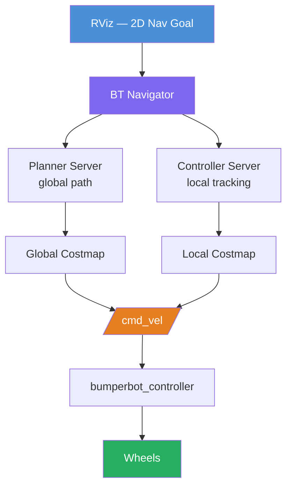
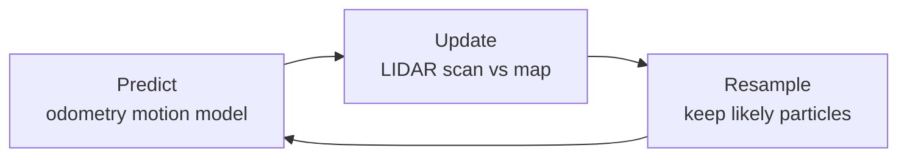
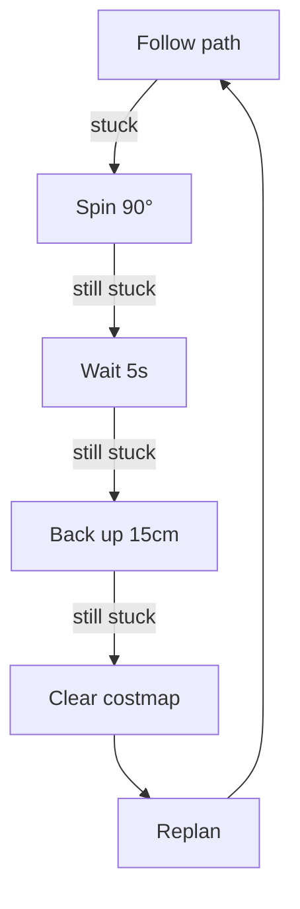
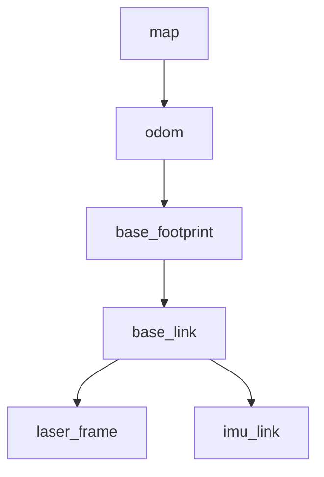

# Section 12 — Autonomous Navigation with Nav2

## Overview

**Nav2** (Navigation 2) is the standard autonomous navigation stack for ROS 2. Given a map of the environment and the robot's current pose, Nav2 plans a collision-free path to a goal and executes it autonomously — handling obstacles, recovery behaviors, and replanning without human intervention.

This section integrates everything built so far: the bumperbot's URDF, differential drive controller, odometry, sensor fusion, and the map from Section 11, into a fully autonomous navigation system.

## Workspace Structure

```
bumperbot_ws/src/
├── bumperbot_description/      # Robot model with LIDAR and IMU
├── bumperbot_controller/       # Differential drive controller
├── bumperbot_localization/     # EKF sensor fusion (from Section 9)
└── bumperbot_navigation/       # Nav2 launch files, costmap configs, BT XMLs
```

## Nav2 Architecture



## Key Components

### AMCL — Localization on the Map

**AMCL** (Adaptive Monte Carlo Localization) estimates the robot's pose on a known map using a **particle filter**. Each particle represents a hypothesis about where the robot is. The filter cycles through three steps:



Over time the particle cloud converges to the true robot pose. The pose uncertainty is represented by the covariance of the particle distribution:

$$P(\mathbf{x}_t \mid z_{1:t},\, u_{1:t},\, m) \approx \sum_{i=1}^{N} w_t^{(i)}\, \delta\!\left(\mathbf{x}_t - \mathbf{x}_t^{(i)}\right)$$

where $w_t^{(i)}$ is the importance weight of particle $i$ and $m$ is the map.

### Global Planner

Computes a collision-free path from the robot's current pose to the goal on the **global costmap** (the full map with inflated obstacles). Available planners:

| Planner | Algorithm | Best for |
|---------|-----------|----------|
| `NavFn` | Dijkstra / A\* | Simple structured environments |
| `SmacPlanner2D` | A\* with analytic expansion | Better path quality |
| `SmacPlannerHybrid` | Hybrid A\* | Non-holonomic motion constraints |

### Local Controller

Tracks the global path in real time on the **local costmap** (a small rolling window around the robot, updated from live sensor data):

| Controller | Description |
|------------|-------------|
| `DWB` (Dynamic Window Approach) | Samples velocity commands, scores by progress + clearance |
| `RPP` (Regulated Pure Pursuit) | Follows the path with speed regulated near obstacles |
| `MPPI` | Model Predictive Path Integral — optimal trajectory sampling |

### Costmap 2D

The costmap inflates every obstacle by the robot's **inflation radius** to create a safety margin. A cell's cost decreases exponentially with distance from the nearest obstacle:

$$\text{cost}(d) = \text{INSCRIBED\_COST} \cdot e^{-\beta (d - r_{\text{inscribed}})}$$

where $d$ is the distance to the nearest obstacle and $r_{\text{inscribed}}$ is the robot's inscribed radius.

| Costmap | Scope | Purpose |
|---------|-------|---------|
| Global | Full map | Input to the path planner |
| Local | Rolling window around robot | Input to the local controller; detects dynamic obstacles |

### Behavior Trees

Nav2 uses **Behavior Trees** (XML files) to define mission logic. This makes recovery from failures declarative and easy to customize:

```xml
<BehaviorTree>
  <RecoveryNode number_of_retries="6" name="NavigateRecovery">
    <PipelineSequence name="NavigateWithReplanning">
      <RateController hz="1.0">
        <ComputePathToPose goal="{goal}" path="{path}"/>
      </RateController>
      <FollowPath path="{path}" controller_id="FollowPath"/>
    </PipelineSequence>
    <ReactiveFallback name="RecoveryFallback">
      <GoalUpdated/>
      <SequenceWithMemory name="RecoveryActions">
        <Spin spin_dist="1.57"/>
        <Wait wait_duration="5"/>
        <BackUp backup_dist="0.15" backup_speed="0.025"/>
        <ClearEntireCostmap service_name="global_costmap/clear_entirely_global_costmap"/>
      </SequenceWithMemory>
    </ReactiveFallback>
  </RecoveryNode>
</BehaviorTree>
```

Recovery sequence when the robot gets stuck:



## Required Packages

```bash
sudo apt install ros-humble-navigation2 ros-humble-nav2-bringup
```

> Pre-installed in the course Docker image.

## Key Configuration Files

### `nav2_params.yaml` (excerpt)

```yaml
bt_navigator:
  ros__parameters:
    use_sim_time: true
    global_frame: map
    robot_base_frame: base_link
    default_bt_xml_filename: "navigate_w_replanning_and_recovery.xml"

controller_server:
  ros__parameters:
    controller_plugins: ["FollowPath"]
    FollowPath:
      plugin: "nav2_regulated_pure_pursuit_controller::RegulatedPurePursuitController"
      desired_linear_vel: 0.3
      max_angular_vel: 1.0

local_costmap:
  local_costmap:
    ros__parameters:
      rolling_window: true
      width: 3
      height: 3
      resolution: 0.05

global_costmap:
  global_costmap:
    ros__parameters:
      robot_radius: 0.12
```

## Running the Examples

```bash
cd ~/ros2_ws && colcon build --symlink-install && source install/setup.bash
```

### Full autonomous navigation in simulation

```bash
# Terminal 1 — Gazebo simulation
ros2 launch bumperbot_description gazebo.launch.py use_sim_time:=true

# Terminal 2 — Nav2 bringup with saved map (produced in Section 11)
ros2 launch bumperbot_navigation navigation.launch.py \
  map:=$HOME/ros2_ws/my_map.yaml \
  use_sim_time:=true

# Terminal 3 — RViz with Nav2 panel
ros2 launch nav2_bringup rviz_launch.py
```

In RViz:
1. Use **2D Pose Estimate** to set the robot's initial position on the map
2. Wait for the AMCL particle cloud to converge
3. Use **2D Nav Goal** to click a destination
4. Watch the robot plan and drive autonomously

### Send a navigation goal from the CLI

```bash
ros2 action send_goal /navigate_to_pose nav2_msgs/action/NavigateToPose \
  "{ pose: { header: { frame_id: 'map' },
             pose: { position: { x: 2.0, y: 1.5, z: 0.0 },
                     orientation: { w: 1.0 } } } }"
```

### Navigate through multiple waypoints

```bash
ros2 action send_goal /follow_waypoints nav2_msgs/action/FollowWaypoints \
  "{ poses: [
    { header: { frame_id: 'map' }, pose: { position: { x: 1.0, y: 0.0 } } },
    { header: { frame_id: 'map' }, pose: { position: { x: 2.0, y: 1.0 } } },
    { header: { frame_id: 'map' }, pose: { position: { x: 0.0, y: 2.0 } } }
  ] }"
```

## TF Tree During Navigation



Nav2 requires the full `map → odom → base_footprint` chain to be present and continuously updated. AMCL publishes `map → odom`; the EKF node publishes `odom → base_footprint`.

## Dependencies

| Package | Purpose |
|---------|---------|
| `navigation2` | Full Nav2 stack: BT navigator, planners, controllers, recoveries |
| `nav2_bringup` | Launch files and default parameter/BT files |
| `slam_toolbox` | Provides `map → odom` during online SLAM + navigation |
| `robot_localization` | EKF for fused `odom → base_footprint` transform |
| `nav2_msgs` | Action interfaces (`NavigateToPose`, `FollowWaypoints`) |

## What You Will Learn

- How AMCL localizes a robot on a pre-built map using a particle filter
- How the global planner computes an obstacle-free path using A\*
- How the local controller follows the path while reacting to dynamic obstacles
- How costmaps represent the environment for safe path planning
- How Behavior Trees define navigation logic and recover from failures
- How to configure and tune Nav2 for a differential drive robot
- How the `map → odom → base_footprint` TF chain enables full autonomous navigation
